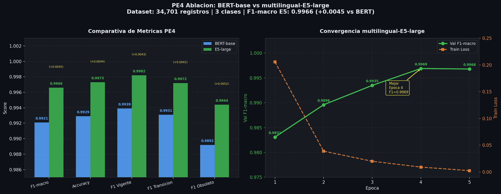

"# kotska1" 

<!-- PE4_RESULTS_START -->
## Resultados PE4 - Clasificacion de Obsolescencia

### Ablacion de Modelos

| Modelo | F1-macro | Accuracy | F1 Vigente | F1 Transicion | F1 Obsoleto |
|--------|:--------:|:--------:|:----------:|:-------------:|:-----------:|
| BERT-base-multilingual | 0.9921 | 0.9929 | 0.9939 | 0.9931 | 0.9892 |
| **multilingual-E5-large** | **0.9966** | **0.9973** | **0.9982** | **0.9972** | **0.9944** |
| Delta E5 vs BERT | **+0.0045** | **+0.0044** | **+0.0043** | **+0.0041** | **+0.0052** |

multilingual-E5-large supera a BERT-base en todas las metricas.
Mayor ganancia en clase Obsoleto (+0.0052).

- Dataset: 34,701 registros | 3 clases
- Epocas: 5 | Batch: 8 | LR: 2e-5
- Mejor epoca: 4/5 | Val F1-macro: 0.9969
- Hardware: Tesla T4
<!-- PE4_RESULTS_END -->